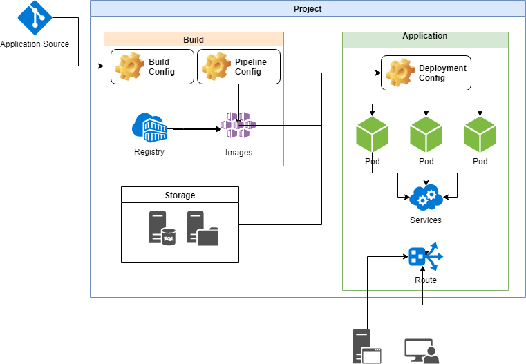
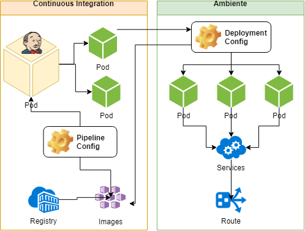

# Preparação do ambiente

Por padrão o minishift não possui algumas imagens e templates e portanto se faz necessário o build e importação dessas imagens.

## Instalação do Minishift

1. Realizar o download do [Minishift] (https://github.com/minishift/minishift/releases)
2. Acrescentar ao PATH o executável do minishift
3. Inicializar o Minishift com o comando `minishift.exe start --cpus 4 --memory 10GB --vm-driver virtualbox`, ajustando os parâmetros de memória e processamento conforme a necessidade
4. Acrescentar as permissões ao usuário administrador com o comando `minishift addon apply admin-user`

O minishift disponibilizará o link de acesso a aplicação no passo 3 e podem ser usados os usuários admin ou developer com a mesma senha

### Entendimento da plataforma

## Instalação de Aplicações para DevOps

1. Criação de um novo projeto para abrigar as aplicações de DevOps:
>    $ oc new-project ci

2. Executar a build para o Jenkins Blue Ocean(Rever com imagem oficial da redhat que permite utilizar configuração de plugins)
>    $ oc new-build jenkins:2~https://github.com/siamaksade/jenkins-blueocean.git --name=jenkins-blueocean

3. Importar o template e criar um Jenkins *EPHEMEREAL*
>    $ oc create -f templates\jenkins-ephemeral-template.yml

 >    $ oc new-app jenkins-ephemeral -p NAMESPACE=ci -p JENKINS_IMAGE_STREAM_TAG=jenkins-blueocean:latest -p MEMORY_LIMIT=2Gi

4. Importar Imagem Stream para o OpenJDK8 para execução de microserviços SpringBoot
>    $ oc create -f templates\jboss-image-streams.json

 >    $ oc create -f templates\openjdk18-image-stream.json

 >    $ oc process -f templates\spring-boot-rest.yaml -v IMAGE_STREAM_NAMESPACE=ci | oc create -f -

5. Importar o template para o Nexus
>    $ oc create -f templates\nexus-template.yaml

6. Importar o template para o SonarQube
>    $ oc create -f templates\sonar-template.yaml

7. Instalar as aplicações Nexus e Sonar pelo console da aplicação

## Configuração para build e deploy das aplicações

Importante Observar a configuração para o CI-CD da aplicação:

1. Processar o arquivo `springboot-rest\spring-boot-rest-buildconfig.yaml` no projeto ci para construir a imagem a partir do código fonte da aplicação
2. Processar o arquivo `springboot-rest\spring-boot-rest-jenkins-pipeline.yaml` no projeto ci para criar o build pipeline da aplicação
3. Processar o arquivo `springboot-rest\spring-boot-rest-deployment.yaml` no projeto dev e projeto tst para criar o deployent da aplicação
4. Criar nos projetos dev e tst o Service Account ci/jenkins para permitir a manipulação dos projetos pelo Jenkins

Toda execução e configuração do pipeline se encontram no arquivo Jenkinsfile do projeto da aplicação.

<!--
Pesquisar:
Mvn Checkstyle

Nos projetos de DEV e TST criar o Service Account Jenkins para o projeto CI
No Projeto CI criar o Service account default e deployer para os projetos de DEV e TST

https://blog.openshift.com/jenkins-slaves-in-openshift-using-an-external-jenkins-environment/
http://blog.andyserver.com/2016/01/jenkins-cluster-openshift/

${parsedVersion.majorVersion}.${parsedVersion.minorVersion}.${parsedVersion.nextIncrementalVersion}

https://readyspace.com.hk/multiple-deployment-methods-for-openshift/

cd /etc/rhsm/ca
wget https://raw.githubusercontent.com/candlepin/python-rhsm/master/etc-conf/ca/redhat-uep.pem

minishift addon apply admin-user

Passos para o CI-CD:
# Criar um novo projeto
oc new-project ci
# Criar Configurações para o Jenkins Blue Ocean
oc new-build jenkins:2~https://github.com/siamaksade/jenkins-blueocean.git --name=jenkins-blueocean
# Importar e criar um Jenkins EPHEMEREAL
oc -create -f images-templates\jenkins-ephemeral-template.yml
oc new-app jenkins-ephemeral -p NAMESPACE=ci -p JENKINS_IMAGE_STREAM_TAG=jenkins-blueocean:latest -p MEMORY_LIMIT=2Gi
# Importar Imagem Stream para o OpenJDK8 (Realizar Download e acrescentar ao /etc/docker/certs.d/registry.access.redhat.com - https://raw.githubusercontent.com/candlepin/python-rhsm/master/etc-conf/ca/redhat-uep.pem)
oc create -f images-templates\jboss-image-streams.json
oc create -f images-templates\openjdk18-image-stream.json
oc process -f images-templates\spring-boot-rest.yaml -v IMAGE_STREAM_NAMESPACE=ci | oc create -f -
# Criar o Pipeline para build e deployment
oc create -f images-templates\spring-boot-rest-pipeline.yaml

f4aae16adc8a906c3c2055823627e04ccbe1eb8b
2b1df3f2c60774e387f334712577832d040e33d9
Documentar e melhorar os arquivos:
- spring-boot-rest.yaml
- spring-boot-rest-pipeline.yaml

oc tag ci/springboot:latest dev/springboot:latest -n ci
-->

### Próximos Passos:
- Criar imagens personalizadas(Docker)
